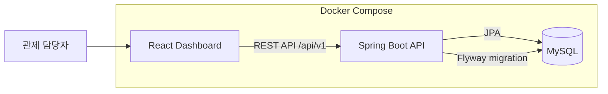
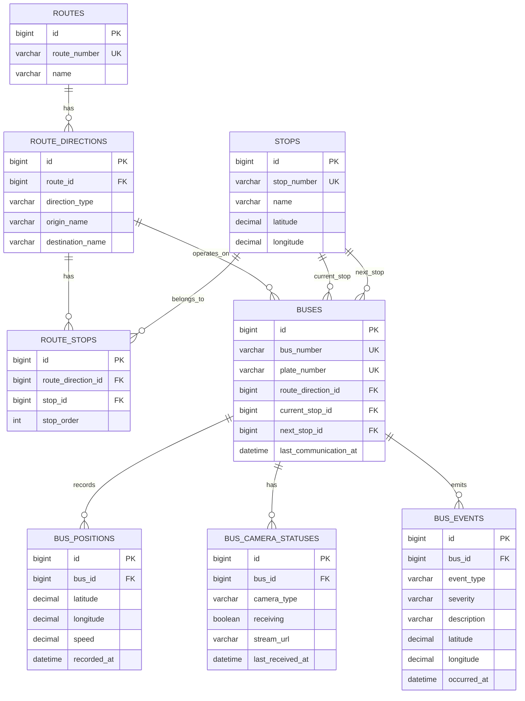

# 서울 버스 관제 시스템 MVP 설계 문서

## 1. 목표

이 프로젝트는 관제 담당자가 웹 화면에서 현재 운행 중인 버스의 상태를 확인할 수 있는 MVP이다.

MVP의 핵심은 실제 영상 스트리밍 구현이 아니라, 버스 위치, 노선, 정류장, 이벤트, 통신 상태를 하나의 관제 화면에서 확인할 수 있도록 데이터 구조와 조회 흐름을 설계하는 것이다.

## 2. 시스템 구조

- 프론트엔드는 React 대시보드로 버스 목록, 상세 패널, 지도, 최근 이벤트를 표시한다.
- 백엔드는 Spring Boot REST API로 관제 화면에 필요한 조회 데이터를 제공한다.
- MySQL은 버스, 노선, 정류장, 위치 이력, 이벤트, 카메라 수신 상태를 저장한다.
- Flyway는 스키마와 Mock Data를 버전 관리해 실행 환경마다 같은 초기 데이터를 구성한다.
- Docker Compose는 MySQL, 백엔드, 프론트엔드를 한 번에 실행한다.

## 3. 데이터 모델

### 설계 의도

- `Route`는 노선번호와 노선명을 가진 노선 자체를 의미한다.
- `RouteDirection`은 같은 노선 안의 상행/하행 운행 패턴을 분리한다.
- `RouteStop`은 노선 방향별 정류장 순서를 저장한다. 같은 정류장이라도 방향에 따라 순서가 달라질 수 있기 때문이다.
- `Bus`는 현재 운행 중인 노선 방향, 현재 정류장, 다음 정류장, 마지막 통신시간을 가진다.
- `BusPosition`은 GPS 위치 이력이다. 목록과 지도에서 쓰는 현재속도와 현재 위치는 최신 위치를 기준으로 계산한다.
- `BusEvent`는 급정거, 급가속, 급감속, 충격 등 관제 이벤트를 저장한다.
- `BusCameraStatus`는 MVP 범위에서 실제 영상을 저장하지 않고 카메라별 수신 상태만 표현한다.

## 4. API 흐름

프론트엔드는 다음 API를 조합해 대시보드를 구성한다.

| API | 목적 |
| --- | --- |
| `GET /api/v1/buses` | 버스 목록과 요약 상태 조회 |
| `GET /api/v1/buses/{busId}` | 선택한 버스의 상세 상태 조회 |
| `GET /api/v1/buses/positions/latest` | 지도에 표시할 전체 버스 최신 위치 조회 |
| `GET /api/v1/buses/{busId}/positions/latest` | 선택한 버스의 최신 위치 조회 |
| `GET /api/v1/events/recent` | 최근 이벤트 조회 |

화면의 초기 로딩 흐름은 다음과 같다.

1. 버스 목록, 전체 최신 위치, 최근 이벤트를 조회한다.
2. 첫 번째 버스를 기본 선택해 상세 정보를 조회한다.
3. 목록 또는 지도 마커를 선택하면 해당 버스 상세 정보를 다시 조회한다.
4. 목록, 위치, 상세 정보는 5초 주기로 갱신하고 최근 이벤트는 10초 주기로 갱신한다.

## 5. 통신 상태 계산

차량 상태는 별도 컬럼으로 저장하지 않는다.

백엔드는 조회 시점의 기준 시각과 `lastCommunicationAt`을 비교해 상태를 계산한다.

- 5분 이하: `ONLINE`
- 5분 초과: `OFFLINE`

이 방식은 저장 데이터와 현재 상태가 어긋나는 문제를 줄이고, 상태 기준이 바뀌어도 계산 로직만 변경하면 된다.

## 6. 실시간 갱신 방식

MVP에서는 WebSocket 대신 Polling을 선택했다.

이유는 다음과 같다.

- 구현과 운영 구성이 단순하다.
- HTTP 기반 조회 API만으로 가산점 요구사항인 실시간성 표현이 가능하다.
- 버스 수, 관제 화면 수, 갱신 주기가 커지는 시점에 WebSocket, SSE, 메시지 브로커 구조로 확장할 수 있다.

현재 주기는 다음과 같다.

- 버스 목록: 5초
- 전체 위치: 5초
- 선택 버스 상세: 5초
- 최근 이벤트: 10초

## 7. Docker 실행 구조

루트 `compose.yaml`은 다음 서비스를 실행한다.

- `mysql`: MySQL 8.4 데이터베이스
- `backend`: Spring Boot API 서버
- `frontend`: Nginx로 서빙되는 React 정적 빌드 결과

프론트엔드 컨테이너는 `/api` 요청을 백엔드 컨테이너의 `8080` 포트로 프록시한다. 브라우저에서는 `http://localhost:3000`으로 전체 애플리케이션을 확인할 수 있다.

## 8. 확장 방향

실제 서울시 전체 버스 관제 시스템으로 확장하려면 다음 구조가 필요하다.

- 차량 단말 데이터 수집 API와 인증 체계 분리
- 위치와 이벤트 쓰기 트래픽을 처리할 메시지 브로커 도입
- 최신 위치 조회 최적화를 위한 Redis 또는 전용 read model 도입
- 관제 화면 실시간 갱신을 위한 WebSocket 또는 SSE 도입
- 영상 처리를 위한 미디어 서버, Object Storage, CDN, 영상 메타데이터 테이블 분리
- 사고 탐지와 안전운전 분석을 위한 이벤트 파이프라인 구성
- 운영 관측성을 위한 로그, 메트릭, 트레이싱, 알림 체계 추가

이번 MVP는 이 확장 구조의 첫 단계로, 관제 화면에 필요한 핵심 데이터 모델과 조회 API를 먼저 구현했다.
